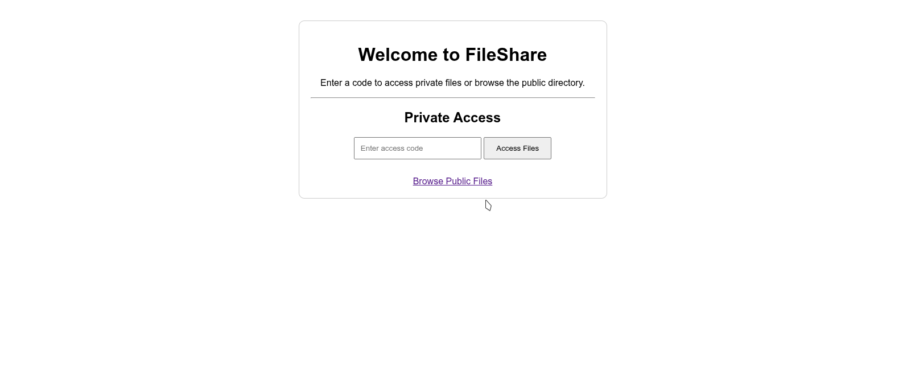
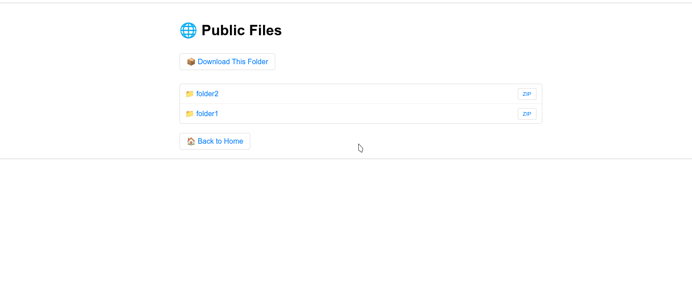

# ShareServer 🚀

A super lightweight file sharing server that's only **20MB** and packs a punch! Share files like a boss with password protection and nested folder support. No bloat, no nonsense - just pure file sharing goodness! 

## What can this bad boy do? 🔥

### 🔒 Private Files (The Secret Sauce!)
- **Password protected folders** - Nobody can even see that your private files exist!
- **Custom access codes** - Create your own secret codes for different folders
- **Nested folder support** - Go as deep as you want in your folder structure
- **Individual file downloads** - Grab just what you need
- **ZIP folder downloads** - Download entire folders as ZIP files in one click!

### 🌐 Public Files (Share with the world!)
- **Open access** - Let anyone browse your public files
- **Same awesome features** - Nested folders, ZIP downloads, the works!
- **No password needed** - Perfect for sharing stuff openly

### 🎯 The Cool Stuff
- **Breadcrumb navigation** - Never get lost in your folders!
- **Clean, simple UI** - No fancy colors or distracting stuff, just works!
- **Emoji icons** - 📁 folders, 📄 files, 📦 ZIP downloads - easy to understand!
- **Mobile friendly** - Works great on your phone too!
- **Lightning fast** - Spring Boot + Java = speed demon! ⚡

## How does the private magic work? ✨

1. **Set up secret codes** in your config like `{'openfile4': 'folder4'}`
2. **Enter the code** `openfile4` on the website
3. **Boom!** You get access to `folder4` and all its subfolders
4. **Navigate freely** - browse, download files, download entire folders as ZIP!

The best part? If someone doesn't know your code, they can't even tell that private files exist! 🤫

## What you get 📦

- **Browse files and folders** with a clean web interface
- **Download individual files** with a single click
- **Download entire folders as ZIP** - perfect for bulk downloads!
- **Navigate nested folders** like a file explorer
- **Password protect specific folders** while keeping others public
- **Super lightweight** - the entire server is just 20MB!

## Perfect for... 🎯

- **Personal file server** - Host your own files at home
- **Small team sharing** - Share project files with colleagues  
- **Family photos** - Keep private family stuff secure, public stuff open
- **Development assets** - Share code, docs, and resources
- **Quick file drops** - Better than email attachments!

## Tech Stack 🛠️

- **Spring Boot** - Robust and reliable backend
- **Thymeleaf** - Clean HTML templating  
- **Maven** - Easy dependency management
- **Java 21** - Modern, fast, and secure
- **Pure HTML/CSS** - No heavy frontend frameworks!

---

Ready to get started? Check out [Installation.md](Installation.md) for setup instructions! 

It's literally just `git clone` and `mvn spring-boot:run` for development - no npm nonsense! 🎉

# Gallery (videos too !)

## 🎬 See it in action!

**Normal folder browsing:**
<video width="600" controls>
  <source src="video/first1.webm" type="video/webm">
  Your browser does not support the video tag.
</video>

**Private folder access protection:**
<video width="600" controls>
  <source src="video/first2.webm" type="video/webm">
  Your browser does not support the video tag.
</video>

